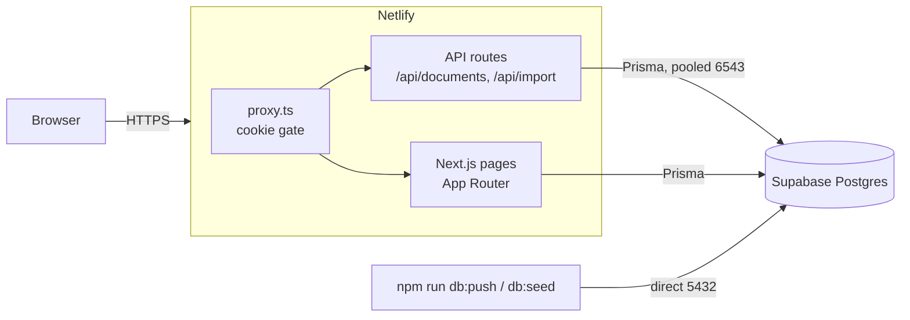
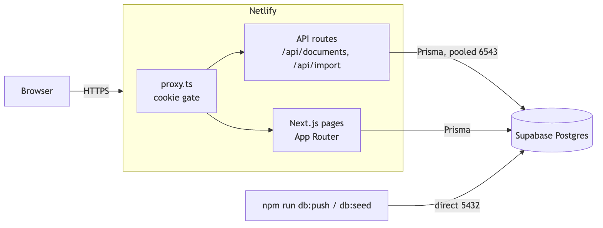
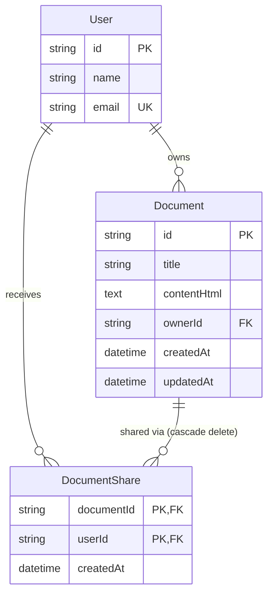
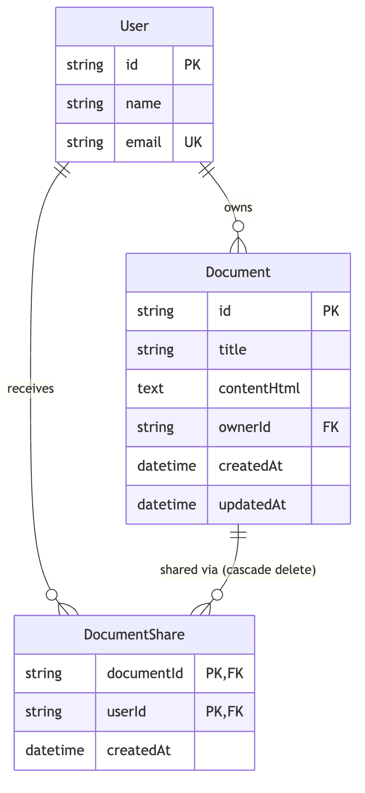
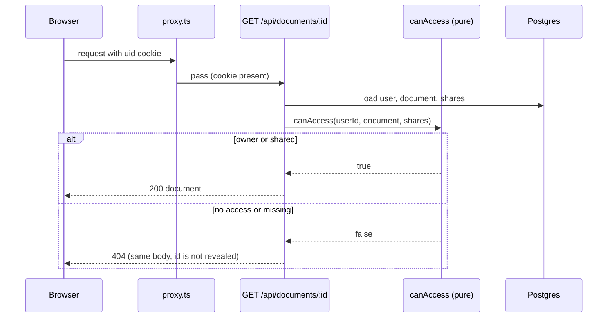
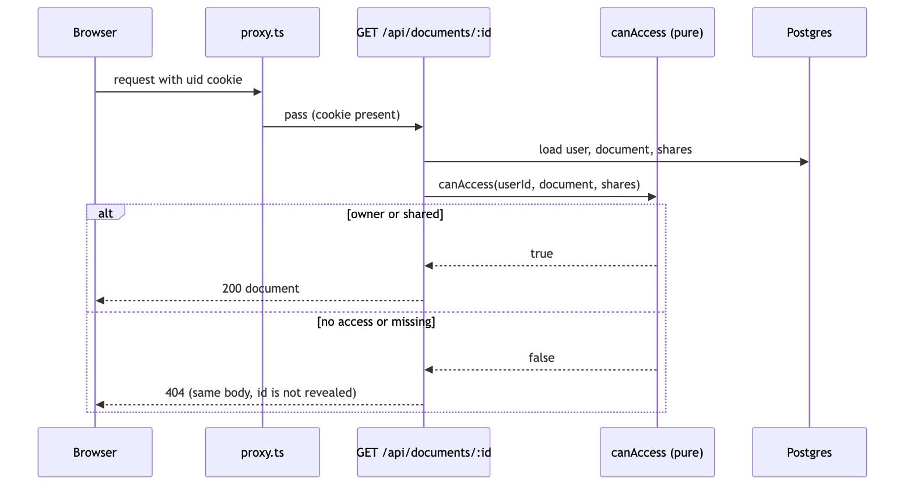
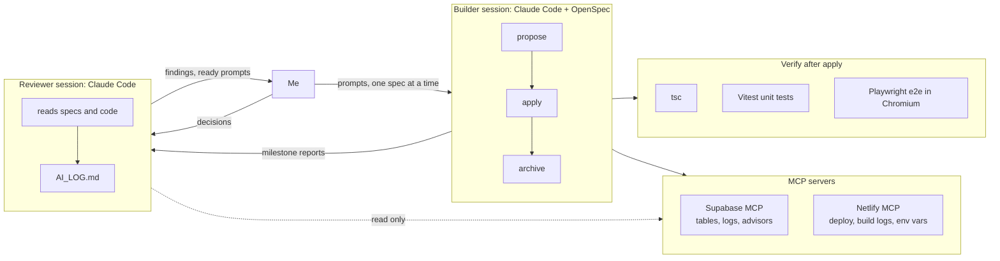
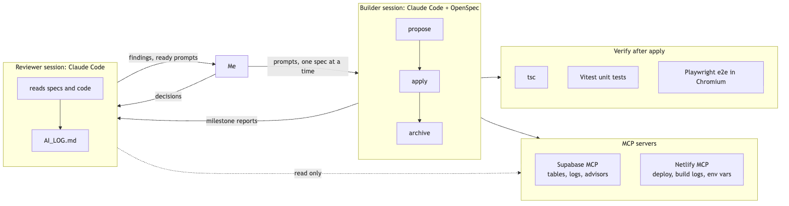
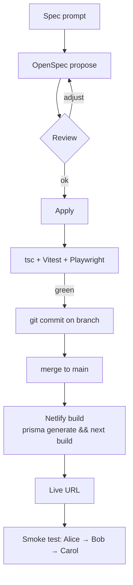
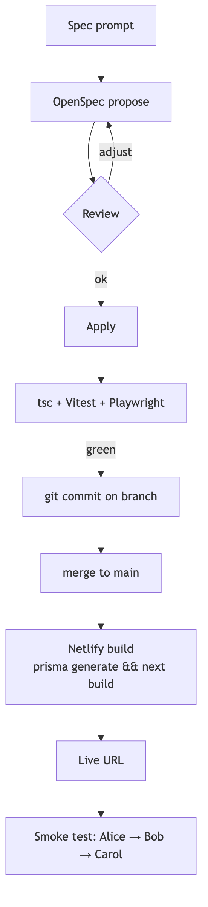

# Architecture

Ajaia Docs is a small collaborative document editor. Timebox: 4 to 6 hours.
Goal: one coherent working slice, not Google Docs.

Diagrams are Mermaid. Rendered copies live in `diagrams/` as SVG and PNG.

## System

- One deploy on Netlify holds the frontend and the backend. API routes run as Netlify Functions.
- The request gate only checks that the `uid` cookie exists. Every route re-checks access in the database.
- Two database URLs: pooled for the running app, direct for schema push and seed.

## Data model

- Content is stored as sanitized HTML, not editor JSON. File import produces HTML, so one pipeline serves both paths.
- Access is binary: owner, or shared. Only the owner can delete and manage sharing.

## Opening a document

## AI-native workflow

- Two Claude Code sessions. One builds, one reviews. I decide what changes.
- OpenSpec keeps each change small: proposal, specs, tasks, then apply, then archive.
- AI_LOG.md records what I kept, changed and rejected.

## Delivery pipeline

## Priorities and cuts

Built: create, rename, edit, autosave, reopen, rich text, sharing, file import, persistence, tests, deploy.

Cut on purpose: real auth, real-time editing, roles, comments, version history.

Next 2 to 4 hours: export to Markdown, presence indicator, per-document delete from the dashboard, signed session cookie.
